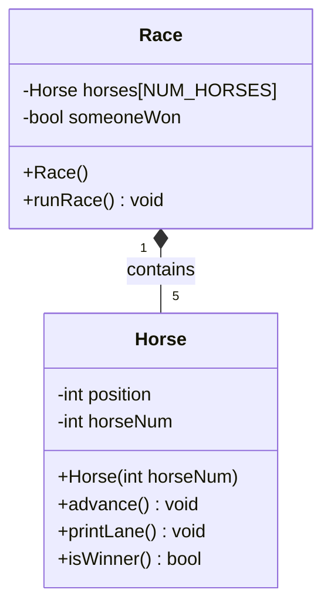

# -lab-OOP-horse-race

Horse::advance()
- flip a coin (random 0 or 1)
- if heads, increase this horse's position by 1

Horse::printLane()
- loop from 0 to TRACK_LENGTH - 1
- if the loop position equals this horse's position, print this horse's number
- otherwise print a dot
- print a newline

Horse::isWinner()
- return (this horse's position >= TRACK_LENGTH - 1)

Race::runRace()
- while no horse has won:
    - for each horse in the horses array:
        - call advance() on that horse
        - call printLane() on that horse
        - if isWinner() on that horse is true:
            - mark someoneWon true
            - print the win message for that horse
    - if no one has won, prompt for Enter and wait

## Extra Effort — Betting Prompt

Before the race starts, the user is prompted to bet on which horse will win
(0-4). After the race finishes, the program compares the bet against the
actual winner and reports whether the user won or lost.

This is implemented entirely in `main.cpp`, without modifying the internal
logic of the `Horse` class. The one change to existing code was updating
`Race::runRace()` to return the winning horse's number (previously `void`)
so `main()` could compare it against the bet.

